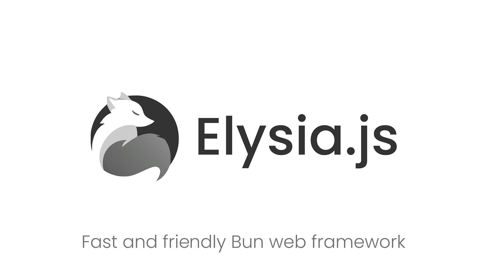
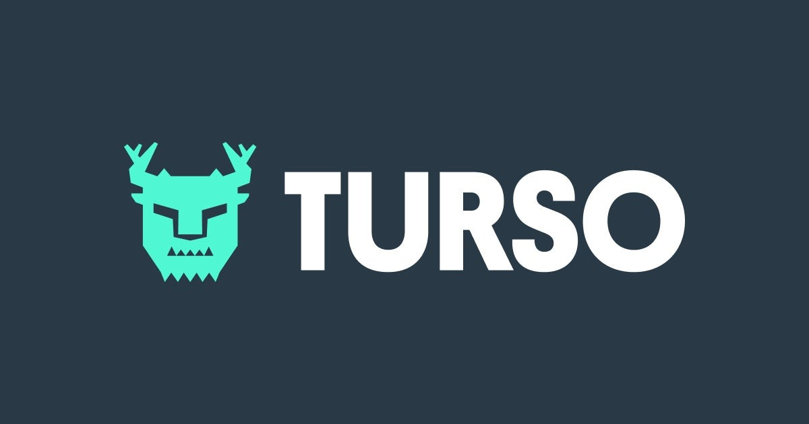
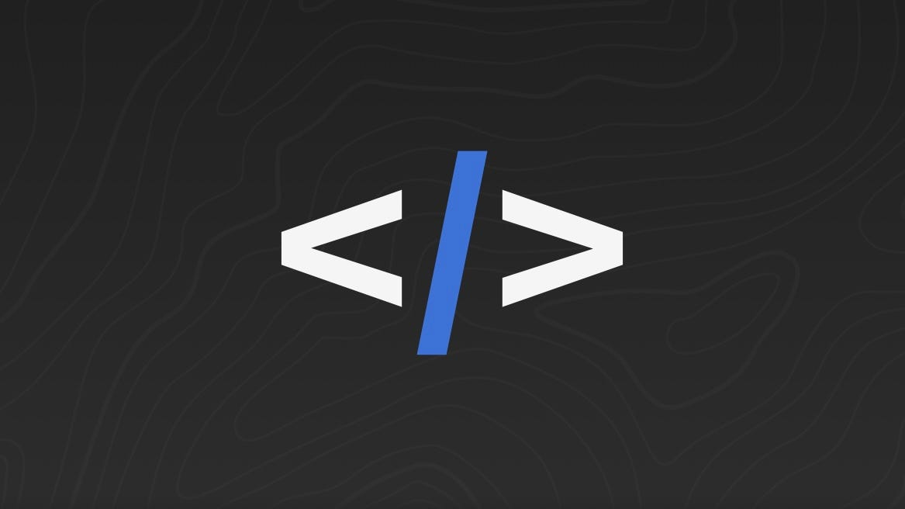

# Frameworks

The BETH stack consists of 4 main frameworks:

- [Bun](#bun)
- [Elysia](#elysia)
- [Turso](#turso)
- [HTMX](#htmx)
- [Additional](#additional)

  We will cover each one individually.

# Bun

Bun is an all-in-one JavaScript/TypeScript toolkit that includes:

A runtime that supports TypeScript and JSX out of the box, it's incredibly fast because it extends JavaScriptCore instead of using V8 like Node.js.

A package manager that is compatible with npm, and -of course- a lot faster.

An incredibly fast test runner with Jest compatible syntax and ability to simulate the DOM using happy-dom.

A modern JavaScript bundler (still in beta at the moment).

Bun focuses on performance and developer experience, and it's a drop-in replacement for Node.js, making migration very straightforward.

# Elysia

Elysia is a Bun TypeScript server framework with great performance and developer experience.

Some of its powerful features include:

Incredible performance, reaching speeds up to 18x faster than Express.

Super simple development, allowing you to create API endpoints by just returning the desired response data, no unnecessary methods or boilerplate.

Strict-typing -powered by TypeBox- enforces type-strict validation to ensure type integrity by default.

OpenAPI compliance, allowing Elysia to automatically generate OpenAPI 3.0 specs with the Swagger plugin.

End-to-end type safety synchronizing types across all applications.

An active ecosystem of plugins to help integrate your Elysia server with multiple tools and frameworks, including: Swagger, GraphQL Yoga, tRPC, Vite, Web Socket, and more.

# Turso

Turso is an edge-hosted, distributed database based on libSQL, an open-source and open-contribution fork of SQLite.

Developers love Turso for its simplicity and performance around the globe, and it offers integrations with multiple popular platforms like Vercel, Cloudflare, Netlify, and more.

# HTMX

HTMX is a small and powerful library that gives you access to AJAX, CSS Transitions, WebSockets, and Server Sent Events, directly from HTML, eliminating the need to write unnecessary JavaScript code.

I've talked about HTMX in more detail in this article: HTMX: Hypertext for the Modern Web.

# Additional

- Typed-html
- unoCSS
- Hyperscript
- Drizzle

# How to use the BETH stack

The BETH stack revolves around using JSX with HTMX and Hyperscript for interactivity in a Bun & Elysia server, building a light and fast website.

Get more information from the-beth-stack GitHub repository.
