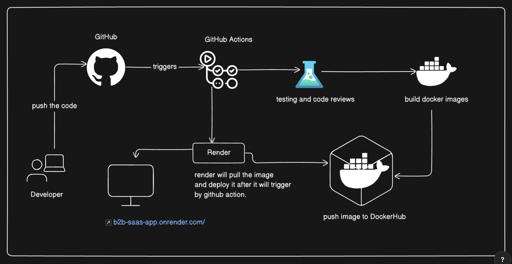

# CI/CD Pipeline

### [Link to above canvas](https://app.eraser.io/workspace/wSaiPZPORvI7o7ZJjJRP?origin=share)

## Github Actions

After pushing code on Github, it will activate the github actions.

### It contains following Jobs

- Check code
- Try to build project
- Bun install
- Bun test
- Build Docker image
- Push Docker image on DockerHub
- Trigger deployment in Render

## Docker

First we build the docker image using github actions after that we will push the image on Dockerhub again using github actions.

If any user want they can directly pull the image and get started.

## Render

Github Action will trigger the deployment after all the testing. We build image and push image to DockerHub. Now, Render will pull the newly deployed Docker image from DockerHub. It will now deploy new image.

This is the whole CI/CD pipeline used for B2B-SAAS-APP
