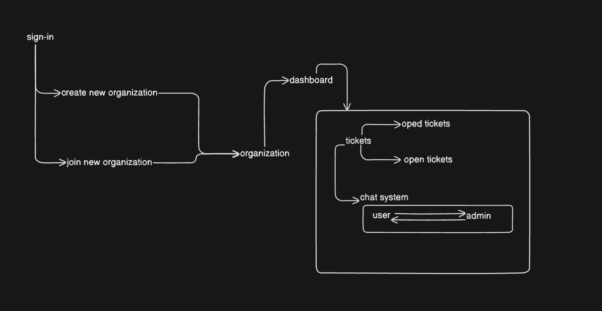

# B2B-SAAS-APP

### [Link to above canvas](https://app.eraser.io/workspace/wSaiPZPORvI7o7ZJjJRP?origin=share)

## Features

- Google Auth for login.
- Create organization
- Also can join the organization from the Invite Code.
- Multiple Employee can join one organization.
- Admin Dashboard.
- Customer Satisfaction for the week.
- List of all open tickets.
- List of all closed tickets in last week.
- Chat system.
- User can chat with the admin using their tickets.
- User can closed their ticket when issue is solved.
- Admin can also closed the ticket if want.
- Sign-out to delete all the sessions.

### Info

It is a B2B app in which organization can register themself. After that they can share the link for creating the Ticket. User who create the Ticket can talk to the organization. People can join the organization using organization code given by the admin. User can close the ticket if they want or the problem is solved or admin can close the tickets.
