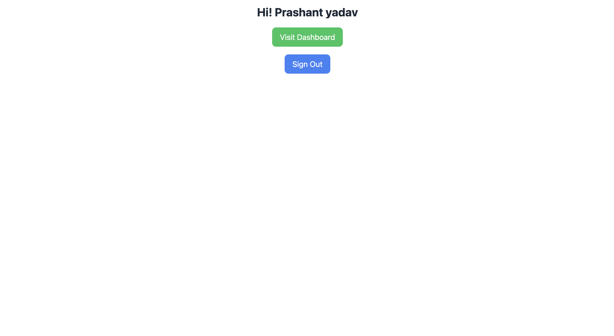
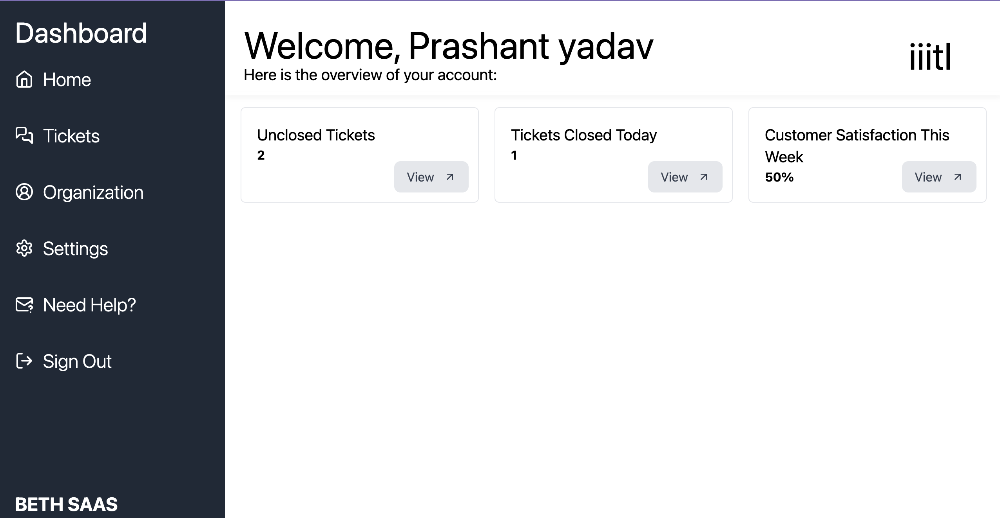

# B2B-SAAS-APP

## Want to learn more about Bun, Elysia, turso and HTMX

- ### Visit the [BETH.md](./BETH.md)

## About the Project:

This is a multi-tenant B2B SaaS application deployed at the edge using the BETH stack. In this application, you can register your organization, after which you will receive a link that can be shared with others to create tickets. Once a ticket is created, users can engage in a chat with you using the same ticket.

### Functionality:

- We use Lucia Auth for authentication.
- Google Auth provides additional security.
- Type safety is used for HTMX.
- Type safety is enforced in both the frontend and backend.
- Drizzle is used for schema management.
- UnoCSS is utilized for styling.
- All data related to an organization is stored separately and can be shared in SQLite with the organization if needed.
- Local SQLite databases are created for frontend caching, reducing latency in data communication.

## Installation with bun

To get start you need [bun](bun) installed into your system.
After that you need to clone the repository

```bash
git clone https://github.com/0PrashantYadav0/b2b-saas-app.git
```

After installing all the dependencies run

```bash
cd b2b-saas-app
bun install
```

Create a new turso database with

```bash
turso db create <name>
```

Get the database url with

```bash
turso db show --url <name>
```

Get the auth token with

```bash
turso db tokens create <name>
```

(Optional) Create a new github developer app and get credentials

Add all the required env variable as per given in [env.example](./.env.example) file.

```bash
bun db:push
```

Now you are good to go

```bash
bun dev
```

## Installation with docker

For this you need to have docker install

Now run

```bash
docker push 0prashantyadav0/saas-app:latest
```

Now run the command to get started

```bash
docker run -p 3000:3000 0prashantyadav0/saas-app:latest
```

## Project Display :



